# Airbnb Android Application

A native Android application inspired by Airbnb, developed using Java and Android Studio.

## Overview

This project was developed as a university project as part of my Computer Engineering studies.

The application lets users browse apartment listings, save favorites, and book stays, with data loaded from a backend.

## Features

- User registration and login
- Dynamic apartment listings loaded from the backend
- Apartment details page with photo gallery, description, price, and amenities
- Full "What this place offers" amenities list, grouped by category
- Wishlist: mark apartments as favorite
- Reservation form with check-in/check-out dates, number of guests, extra services, and payment method
- Automatic total price calculation
- "My Reservations" page with the option to cancel a reservation
- Menu with Wishlist, My Reservations, and Logout

## Technologies

- Java
- Android Studio
- XML
- PHP
- MySQL
- Git/GitHub

## My Contribution

I primarily worked on the backend integration and contributed to the Android frontend development.

My work included connecting the application to dynamic property listing data and contributing to the implementation of the Android application.

## Project Context

Developed as a university project with a partner.

## Screenshots

### Home and Menu
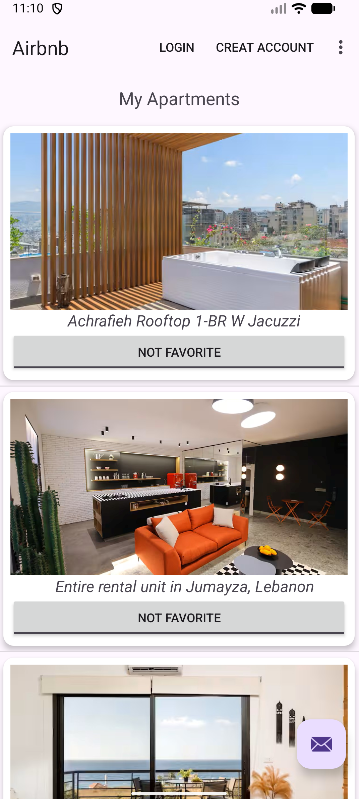 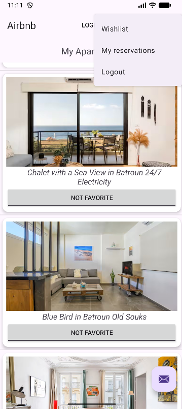

### Sign Up and Login
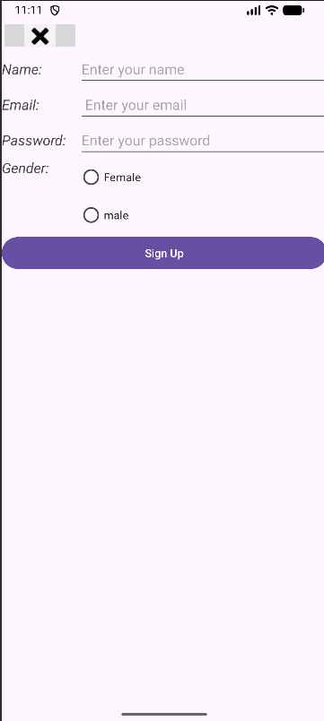 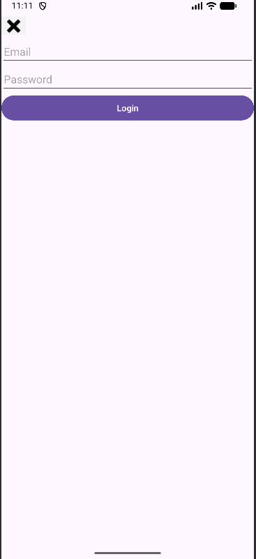

### Apartment Details
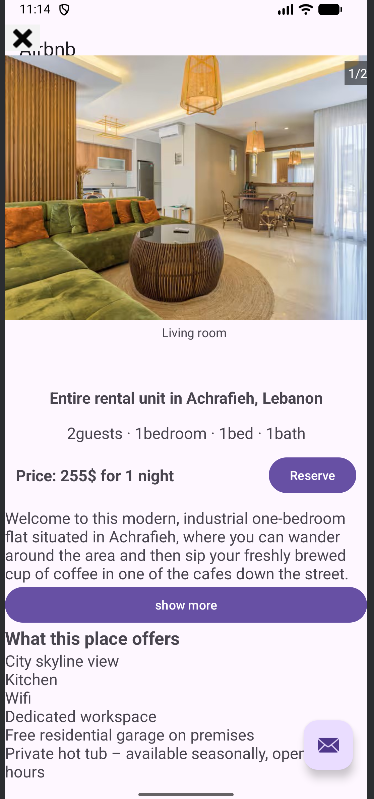 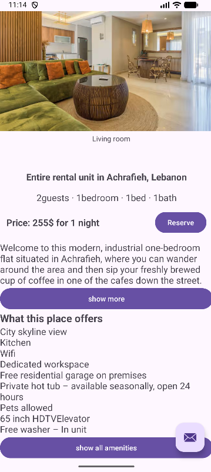 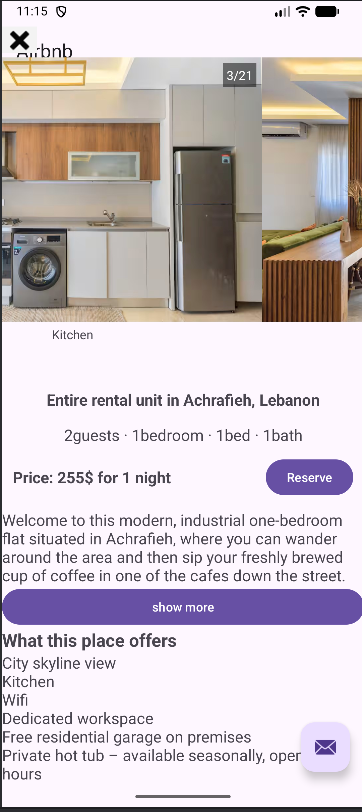

### Amenities and Reservation
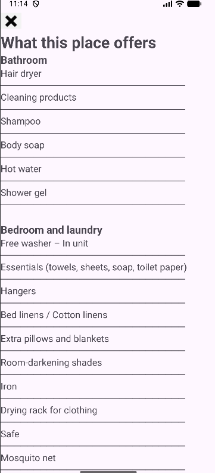 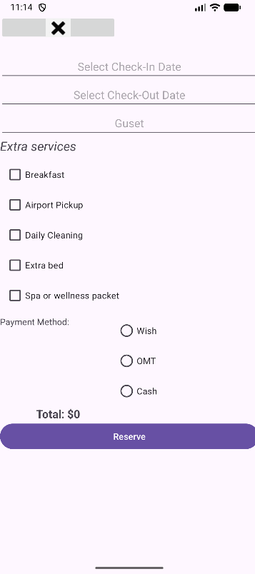

### Wishlist and My Reservations
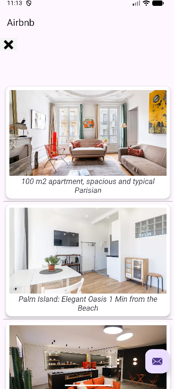 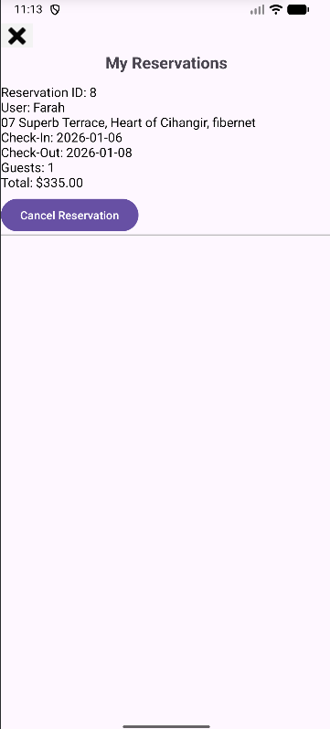

## Getting Started

### Backend and Database Setup

1. Install XAMPP and start Apache and MySQL.
2. Open phpMyAdmin, create a new database named `apartment1_db1`, and import `database/apartment1_db1.sql` into it.
3. Copy the `projectmb` folder into `C:\xampp\htdocs\`.

### Run the App

1. Clone the repository.
2. Open the project in Android Studio.
3. Allow Gradle to sync.
4. Build and run the application on an Android emulator or Android device. If you use the emulator, the server address in the code should be `10.0.2.2`.

## Author

**Farah Al Abdallah**

Computer Engineering Graduate
